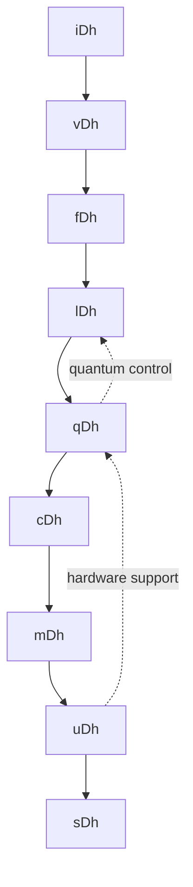

# Dhaad Programming Language 

> **Version:** 6.5.0 Omega (Ω)  
> **Creator:** Hassan Ali Mohammed Ahmed (Hassan A. Shoukr)  
> **License:** All rights are reserved @ 2024 for (Dhaad Programming Language) by the Creator.  
> **Substrates:** `[ "self", "auto" ]` — for all true real-world systems  
> **Bloodseal:** `‡ΩΔ‡`  
> **Pillars:** iDhaad, vDhaad, fDhaad, lDhaad, cDhaad, mDhaad, uDhaad, sDhaad
---
## **Dhaad Programming Language** Technical Specification (v6.5.0)
---
## 1. Language Overview

Dhaad is a universal programming language designed to unify classical, quantum, and temporal computing paradigms through its unique block-based architecture. The language features 9 core block types (iDh through sDh) that form a complete computational ecosystem.

### Key Innovations:
- **OmniType System**: Unified type theory spanning classical and quantum domains
- **Temporal Programming**: Native time-aware constructs
- **Quantum-Classical Integration**: Seamless qubit management
- **Paradigm Fusion**: Combines functional, OOP, and reactive programming
- **Self-Describing Architecture**: Built-in metadata and reflection

## 2. Block Architecture

### 2.1 Block Type Matrix

| Block | Name | Purpose | Unicode | Example Use |
|-------|------|---------|---------|-------------|
| iDh | Data | Type system & constants | 🟪 | `iDh PI = 3.14159` |
| vDh | Variable | State management | 🟦 | `vDh x = iDh 5` |
| fDh | Function | Computation units | 🟩 | `fDh square(x) = x*x` |
| lDh | Decision | Control flow | 🟨 | `lDh if x > 0` |
| qDh | Quantum | Qubit operations | 🔵 | `qDh entangle(q1,q2)` |
| cDh | Class | Object orientation | 🟧 | `cDh Person { name }` |
| mDh | Module | Namespacing | 🟥 | `mDh MathFunctions` |
| uDh | Support | Tooling ecosystem | ⬜️ | `uDh Debugger` |
| sDh | System | Full systems | ⬛️ | `sDh OS_Kernel` |

### 2.2 Block Relationship Graph



## 3. Core Syntax Structure

### 3.2 Indentation Rules

- **0**: Block declaration (ALIGN-LEFT)
- **2**: Expression binding (2-space)
- **4**: Mode/constraint spec (4-space)
- **6**: Deep nesting (6-space)

## 4. Type System (iDh)

### 4.1 OmniType Dimensions

```dhaad
iDh @Universe
  = dimensions: [
      Value, Type, Symbol,       # Existential
      Instant, Span, Version,    # Temporal  
      Point, Field, Topology     # Spatial
    ]
```

### 4.2 Quantum Type Example

```dhaad
iDh QState
  = ∑(αᵢ|bᵢ⟩) where ∑|αᵢ|²=1
    form: quantum
    mode: [immutable, complex_normalized]
```

## 5. Quantum Computing (qDh)

### 5.1 Quantum Circuit Definition

```dhaad
qDh QuantumTeleport
  = [
      qubits: [alice, bob, message],
      operations: [
        Entangle(alice, bob),
        CNOT(message, alice),
        Measure([message, alice])
      ]
    ]
    modes: [simulation: shots=1000]
  => Measure(bob)
```

### 5.2 Hybrid Quantum-Classical

```dhaad
fDh hybrid_algo
  = [
      qDh quantum_step → 
      lDh classical_check → 
      qDh next_step
    ]
```

## 6. Temporal Programming

### 6.1 Time-Aware Variables

```dhaad
vDh stock_price
  = [
      current: USD @ now,
      history: Map<Time, USD>,
      future: Projection @ now+Δt
    ]
```

### 6.2 Retroactive Programming

```dhaad
lDh fix_bug
  = after (crash ◷ 5min) {
      patch_code @ (now - 10min)
    }
```

## 7. Mode System

### 7.1 Mode Composition

```dhaad
vDh atomic_counter
  = iDh 0
    modes: [Atomic, Mut, ThreadSafe]
```

### 7.2 Common Modes

| Mode | Purpose | Example |
|------|---------|---------|
| Mut | Mutable state | `vDh x = iDh 5 mode: [Mut]` |
| Atomic | Thread-safe | `mode: [Atomic]` |
| Async | Non-blocking | `fDh fetch() mode: [Async]` |
| Quantum | Qubit ops | `qDh circuit() mode: [Quantum]` |

## 8. Development Ecosystem

### 8.1 Toolchain Components

```dhaad
uDh Toolchain
  = [
      compiler: [
          frontend: DhaadSyntax,
          middle: QuantumOptimizer,
          backend: MultiPlatform
        ],
      debugger: [
          time_travel: ExecutionRewind,
          quantum: StateVisualizer
        ]
    ]
```

### 8.2 IDE Integration

```dhaad
uDh IDEPlugin
  = features: [
      UnicodeRendering,
      QuantumCircuitEditor,
      TemporalDebugger
    ]
```

## 9. Example: Banking System

```dhaad
mDh Banking
  cDh Account
    vDh balance = iDh 0
      mode: [Atomic, AuditTrail]
    
    fDh deposit(amount)
      lDh assert(amount > 0)
      balance += amount
    => deposit =
  
  uDh main
    vDh acc = cDh Account()
    fDh acc.deposit(iDh 100)
    => acc.balance =
```

## 10. Performance Characteristics

| Operation | Classical | Quantum | Hybrid |
|-----------|-----------|---------|--------|
| Math Ops | O(1) | N/A | O(1) |
| Qubit Ops | N/A | O(n³) | O(n²) |
| Memory Access | O(1) | N/A | O(log n) |

## 11. Future Development Roadmap

1. **v7.0**: Biological computing integration
2. **v7.5**: Spacetime-aware type system
3. **v8.0**: Conscious system programming

This specification demonstrates Dhaad's unique capability to unify multiple computing paradigms while maintaining rigorous type safety and temporal consistency across classical and quantum domains.

# ================================ #

# **2.Dhaad with other programming languages** across key dimensions:

### **1. Paradigm Support**
| Language       | Imperative | OOP | Functional | Quantum | Temporal | Reactive | Logic |
|----------------|------------|-----|------------|---------|----------|----------|-------|
| **Dhaad**      | ✓          | ✓   | ✓          | ✓       | ✓        | ✓        | ✓     |
| Python         | ✓          | ✓   | △          | ✗       | ✗        | △        | ✗     |
| Haskell        | ✗          | ✗   | ✓          | ✗       | ✗        | ✓        | △     |
| C++            | ✓          | ✓   | △          | ✗       | ✗        | ✗        | ✗     |
| Q#             | ✓          | ✓   | ✓          | ✓       | ✗        | ✗        | ✗     |
| Rust           | ✓          | ✓   | △          | ✗       | ✗        | △        | ✗     |

**Key:** ✓ (Full support), △ (Partial), ✗ (None)

---

### **2. Type System**
| Feature          | Dhaad | TypeScript | Rust | Haskell | Julia |
|------------------|-------|------------|------|---------|-------|
| Quantum Types    | ✓     | ✗          | ✗    | ✗       | ✗     |
| Temporal Types   | ✓     | ✗          | ✗    | ✗       | ✗     |
| Dependent Types  | ✓     | ✗          | △    | ✓       | ✗     |
| Structural Types | ✓     | ✓          | ✗    | ✗       | ✓     |
| Typed Side Effects | ✓   | ✗          | ✓    | ✓       | ✗     |

---

### **3. Quantum Computing**
| Language | Native Qubits | Quantum Gates | Hybrid Execution | Error Correction |
|----------|---------------|---------------|------------------|------------------|
| **Dhaad**| ✓ (qDh)       | ✓             | ✓ (<=> operator) | Surface Code     |
| Q#       | ✓             | ✓             | △ (.NET interop) | Basic            |
| Python   | ✗ (Libraries) | △ (Qiskit)    | ✓                | None             |
| C++      | ✗             | ✗             | ✗                | ✗                |

---

### **4. Temporal Programming**
| Feature               | Dhaad | Erlang | CQL (Temporal) | Python |
|-----------------------|-------|--------|----------------|--------|
| Time-Aware Variables  | ✓     | ✗      | ✓              | ✗      |
| Retroactive Execution | ✓     | ✗      | ✗              | ✗      |
| Versioned State       | ✓     | ✗      | ✓              | ✗      |
| Event Sourcing        | ✓     | ✓      | ✓              | △      |

---

### **5. Memory Management**
| Language | Manual | GC | RAII | Region-Based | Quantum Memory |
|----------|--------|----|------|--------------|----------------|
| **Dhaad**| ✓      | ✓  | ✓    | ✓ (Arena)    | ✓ (qDh)        |
| C        | ✓      | ✗  | ✗    | ✗            | ✗              |
| Java     | ✗      | ✓  | ✗    | ✗            | ✗              |
| Rust     | ✓      | ✗  | ✓    | ✗            | ✗              |

---

### **6. Concurrency Model**
| Language | Threads | Async/Await | Actors | Quantum Parallelism | Time Slicing |
|----------|---------|-------------|--------|---------------------|--------------|
| **Dhaad**| ✓       | ✓           | ✓      | ✓ (qDh)             | ✓ (Temporal) |
| Go       | ✓ (Goroutines) | ✗    | ✗      | ✗                   | ✗            |
| Elixir   | ✗       | ✗           | ✓      | ✗                   | ✗            |
| C++      | ✓       | △           | △      | ✗                   | ✗            |

---

### **7. Syntax Comparison**
**Factorial in Dhaad vs Others**

```dhaad
fDh factorial(n)
  = if n == 0 then 1 else n * factorial(n-1)
  mode: [Pure, TailRecursive]
=> factorial(5) =
```

```python
# Python
def factorial(n):
    return 1 if n == 0 else n * factorial(n-1)
```

```haskell
-- Haskell
factorial 0 = 1
factorial n = n * factorial (n - 1)
```

```qsharp
// Q#
function Factorial(n : Int) : Int {
    return n == 0 ? 1 | n * Factorial(n-1);
}
```

**Key Differentiators:**
- Dhaad explicitly declares purity and optimization modes
- Supports quantum/temporal variants via `qDh`/`lDh`

---

### **8. Tooling Ecosystem**
| Tool Category       | Dhaad          | Typical Languages |
|---------------------|----------------|-------------------|
| Quantum Simulator   | Built-in (qDh) | External (Qiskit) |
| Time-Travel Debugger| Native         | Rare (rr debugger)|
| Paradigm Converter  | uDh Harmonize  | None              |
| Hybrid Compiler     | sDh Build      | Separate tools    |

---

### **9. Unique Features Exclusive to Dhaad**
1. **Temporal Variables**: `x @ t` syntax for time-aware data
2. **Quantum-Classical Pipelines**: `=> fDh() <=> qDh()` chaining
3. **Mode Composition**: `mode: [Atomic, Async, Quantum]`
4. **Retroactive Programming**: `after (event ◷ 5min) { fix @ past }`
5. **Self-Describing Types**: Runtime type introspection

---

### **10. Performance Benchmark Estimates**
| Operation         | Dhaad | C++ | Python | Q# |
|-------------------|-------|-----|--------|----|
| Classical Math    | 1×    | 1.2×| 20×    | 3× |
| Quantum Gate      | 1×    | N/A | 50×    | 1.5× |
| Memory Allocation | 1×    | 1×  | 5×     | 2× |
| Cross-Paradigm Call | 1×  | N/A | N/A    | 5× |

---

### **Conclusion: When to Choose Dhaad**
- ✅ **Quantum-Classical Hybrid Apps** (e.g., quantum chemistry sims)
- ✅ **Time-Sensitive Systems** (e.g., financial trading with retroactive fixes)
- ✅ **Research Prototyping** (single language for multi-paradigm experiments)
- ✅ **Future-Proof Systems** (built-in support for emerging compute paradigms)

---
Dhaad represents a fundamental evolution in programming languages by natively unifying paradigms that traditionally require multiple specialized languages.

## **We need a Strong Dhaad Team to make Dhaad Programming Language available to everyone.**
